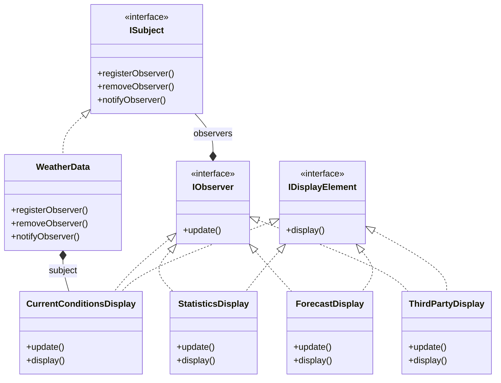

# Weather Station Class Diagram

```mermaid
classDiagram
    class ISubject{
        <<interface>>
        +registerObserver()
        +removeObserver()
        +notifyObserver()
    }
    class IObserver{
        <<interface>>
        +update()
    }
    class IDisplayElement{
        <<interface>>
        +display()
    }
    class WeatherData{
        +registerObserver()
        +removeObserver()
        +notifyObserver()
    }
    class CurrentConditionsDisplay{
        +update()
        +display()
    }
    class StatisticsDisplay{
        +update()
        +display()
    }
    class ForecastDisplay{
        +update()
        +display()
    }
    class ThirdPartyDisplay{
        +update()
        +display()
    }

    ISubject<|..WeatherData
    ISubject --*IObserver : observers
    WeatherData *--CurrentConditionsDisplay : subject
    IObserver<|..CurrentConditionsDisplay
    IObserver<|..StatisticsDisplay
    IObserver<|..ForecastDisplay
    IObserver<|..ThirdPartyDisplay
    IDisplayElement<|..CurrentConditionsDisplay
    IDisplayElement<|..StatisticsDisplay
    IDisplayElement<|..ForecastDisplay
    IDisplayElement<|..ThirdPartyDisplay

```
