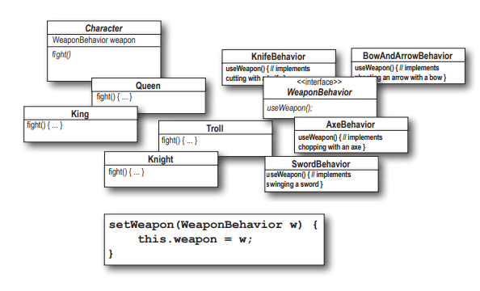
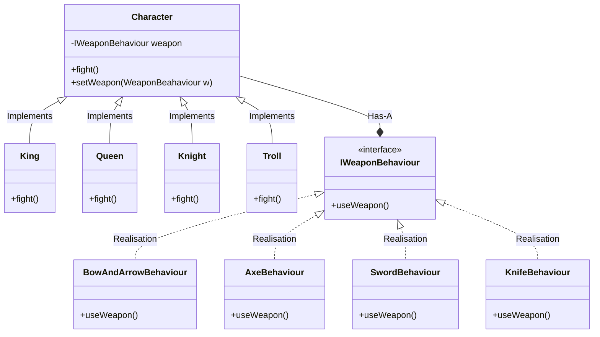

# Design Puzzle

Below you’ll find a mess of classes and interfaces for an action adventure game. You’ll
find classes for game characters along with classes for weapon behaviors the characters
can use in the game. Each character can make use of one weapon at a time, but can
change weapons at any time during the game. Your job is to sort it all out...

1. Arrange the classes.
2. Identify one abstract class, one interface, and eight classes.
3. Draw arrows between classes.
   - Draw this kind of arrow for inheritance (“extends”).
   - Draw this kind of arrow for interface (“implements”).
   - Draw this kind of arrow for HAS-A.
4. Put the method setWeapon() into the right class.

## Solution

