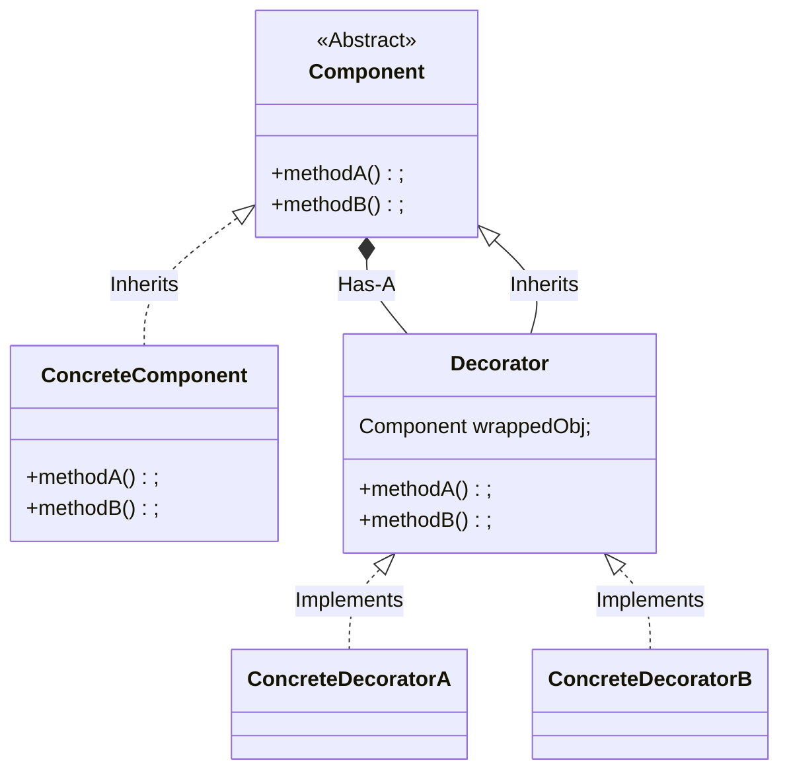
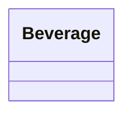

# Decorator Pattern

- Decorators have the same parent type as the objects they decorate.
- You can use one or more decorators to wrap an object.
- Given that the decorator has the same parent type as the object it decorates, we can pass around a decorated object in place of the original (wrapped) object.
- The decorator adds its own behaviour before and/or after delegating to the object it decorates to do the rest of the job.
- Objects can be decorated at any time, so we can decorate objects dynamically at runtime with as many decorators as we like.

> **The Decorator Pattern** attaches additional responsibility to an object dynamically.
> Decorators provide a flexible alternative to subclassing for extending functionality.

## Class diagram

## Implementing in Starbuzz Coffee

