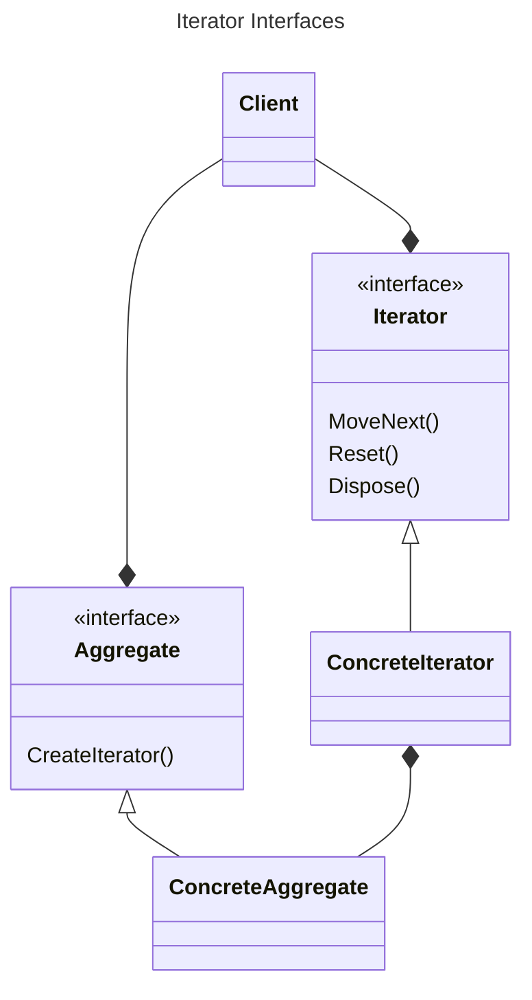

```mermaid
---
title: Iterator Interfaces
---
classDiagram
    class Client
    class Aggregate{
        <<interface>>
        CreateIterator()
    }
    class Iterator{
        <<interface>>
        MoveNext()
        Reset()
        Dispose()
    }
    class ConcreteAggregate
    class ConcreteIterator
    Aggregate <|-- ConcreteAggregate
    Iterator <|-- ConcreteIterator
    ConcreteIterator *-- ConcreteAggregate

    Client --* Aggregate
    Client --* Iterator

```
